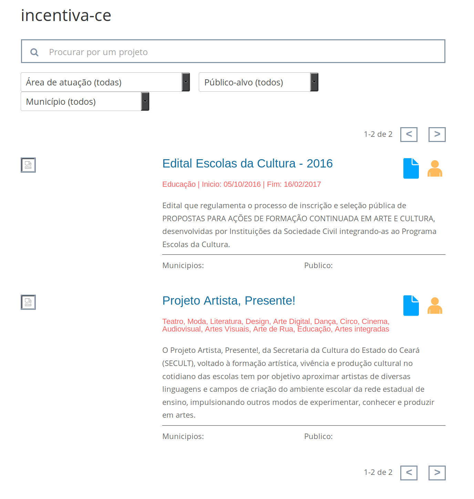

# Mapas Builder

Plugin WordPress que habilita um shortcode para buscar informações da API do **MapasCulturais**, e insere um módulo adicional ao Divi Builder, que permite configurar esse shortcode.

[](https://t.me/cinza)

# Screenshot


## Shortcodes
### [list_entities]
Lista entidades de uma instalação do Mapas Culturais

**Exemplo:**
```
<div class="row list_entities_item">
    <div class="col-md-3"></div>
    <div class="col-md-9">
    <h3><a href="{{singleUrl}}" target="_blank">{{name}}</a></h3>
    <p>{{shortDescription}}</p><br>
    </div></div>
```

## Templating
### Mustache.js
Minimal templating with {{mustaches}} in JavaScript - https://github.com/janl/mustache.js/

**Exemplo:**
```
<div class="row list_entities_item">
  {{#avatarBig.url}}<div class="col-md-3"></div>{{/avatarBig.url}}
  <div class="col-md-9">
    <h3><a href="{{singleUrl}}" target="_blank">{{name}}</a></h3>
    <p>{{shortDescription}}</p><br>
  </div>
</div>
```

#### Atributos
- **`url`***(obrigatorio)*:
	URL da instalação do Mapas Culturais.

	**Exemplo**: `http://mapa.hackers.org.br/`

- **`entity`**:
	Tipo da entidade a ser listada.

	**Padrão**: `event`

- **`select`**:
	Campos a serem retornados pela API

    **Padrão**: `name,shortDescription`

- **`files`**:
	Arquivos a serem retornados pela API

    **Padrão**: `header.header,avatar.avatarBig`

- **`order`**:
	Ordenação na qual o resultado será exibido

    **Padrão**: `id DESC`

- **`limit`**:
	Limite de resultados retornados pela API

    **Padrão**: `10`

- **`pagination`**:
	Se a paginação deva ser incluida na renderização do resultado da API

    **Padrão**: `false`

- **`seals`**:
	Filtra os resultados, mantendo somente os que tiverem os selos especificados.

    **Exemplo**: `1,3,25`

- **`profiles`**:
	Filtra os resultados, mantendo somente os que tiverem linkados aos profiles especificados.

    **Exemplo**: `1,3,25`

- **`filters_input`**:
    Adiciona campos no front-end para filtragem pelo usuario. Tipos implementados: `text`, `select`

    **Sintaxe**: `id`,`tipo de input`,`valor(es)`

    **Exemplo**: `project_name,select,bienal:Bienal+festival:Festival`

- **`filters`**:
    Filtra os resultados da API. Utiliza Mustache para templating da pesquisa, fornecendo os valores dos campos do `filters_input`.

    **Exemplo 1**: `name=ILIKE(Bienal%)&id=BET(1,100)`

    **Exemplo 2**: `{{#project_name}}name=OR(ILIKE({{project_name}}),ILIKE(%{{project_name}}%),ILIKE(%{{project_name}}),ILIKE({{project_name}}%)){{/project_name}}`


Projeto inspirado pelo plugin [medialab-ufg/list-events-shortcode](https://github.com/medialab-ufg/list-events-shortcode)
